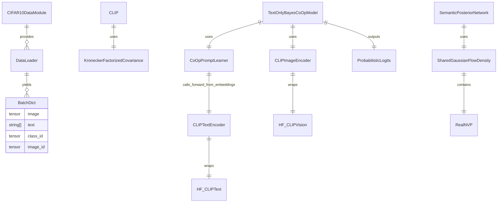

# Iamgosun/person_repo 深度研究报告与可复制 README（以 CIFAR-10 为准）

## Executive Summary

本次研究**优先且首先使用已启用的连接器：GitHub（api_tool: github）**，并且**仅审查你指定的仓库 `Iamgosun/person_repo`** 的源码与脚本；在完成对仓库的覆盖性梳理后，才补充检索少量高质量公开资料（优先官方文档与原始论文/项目页）用于解释 CIFAR-10、CLIP/BayesVLM、DataLoader 参数语义等背景概念。citeturn16search1turn16search32turn5search1turn10search1turn8search2

结论上，这个仓库的“CIFAR-10 基准”并不是传统意义上从零训练一个 CNN 分类器，而是围绕 **BayesVLM（ICLR 2026）** 思路做的实验性改造：用 CLIP/SigLIP 的图像/文本编码器（多为冻结），通过 **Hessian→投影层后验协方差** 做不确定性传播，再在下游进行零样本评估或轻量训练（如 CoOp soft prompt、或实验性的 PostNet 式密度证据头）。仓库自带的 CIFAR-10 DataModule 默认**不负责下载原始 CIFAR-10**，而是假设你已将数据整理成 `ImageFolder(train/..., test/...)` 的目录结构；仓库还留有一个基于 Hugging Face Datasets 自动下载的 CIFAR-10 版本文件，但默认工厂未启用它。citeturn10search1turn9search0turn8search2turn5search1

你特别强调的“**接收什么 → 怎么处理 → 输出什么**”，在仓库里可以概括为三条主链路：

1) **数据链路**：`Dataset.__getitem__` 返回一个 dict（含 `"image"`、`"text"`、`"class_id"`、`"image_id"`…）→ `collate_fn` 将其堆叠成 batch dict（`image: [B,3,H,W]`，`text: list[str]`，`class_id: [B]`）。  
2) **特征链路**：`CLIPImageEncoder/CLIPTextEncoder` 接收 batch dict（或字符串列表/图像 tensor）→ 输出 embedding（或 `EncoderResult{embeds, activations, residuals}`）。  
3) **预测链路**：VLM 头 `CLIP/SIGLIP` 接收 `EncoderResult`（含协方差传播所需 activations）→ 输出 `ProbabilisticLogits(mean,var)` → `softmax()`（probit/采样）得到概率，并在脚本里计算 ACC/NLPD/ECE 或保存 checkpoint。citeturn10search1turn8search2turn5search1

---

## 研究范围与仓库概览

**连接器与范围声明（按你的要求显式写明）**  
已启用连接器：**GitHub**。本报告的代码证据与路径引用，均来自对 **`Iamgosun/person_repo`** 的审查（通过 GitHub 连接器抓取源码文件内容）；本段之后若出现外部资料引用，仅用于解释概念（CIFAR-10 官方说明、PyTorch/Lightning/HF 文档、BayesVLM/CLIP/CoOp/PostNet 论文等），不会替代仓库源码事实。citeturn16search1turn8search2turn10search1turn5search1turn11search0

**仓库主结构（与 CIFAR-10 相关的核心子项目）**  
从源码分布与脚本入口看，本仓库的核心实际集中在 `BayesVLM/` 目录下（README 也明确这是基于上游 AaltoML/BayesVLM 的实验性改造版本，且仍在开发整理中）。关键脚本与模块大致分为四类：

- 数据与 DataModule：`BayesVLM/bayesvlm/data/*`，其中 CIFAR-10 为 `cifar10.py`（默认）与 `cifar10_or.py`（HF datasets 版本，未在 factory 默认启用）。  
- 模型封装：`bayesvlm/image_encoder.py`、`bayesvlm/text_encoder.py`、`bayesvlm/vlm.py`、`bayesvlm/common.py`。  
- Hessian / 协方差推断：`bayesvlm/hessians.py` + `BayesVLM/scripts/hessian_estimation.py`。  
- 下游评估/训练入口：`BayesVLM/zeroshot.py`（零样本评估）、`BayesVLM/train_text_only_bayes_coop.py`（训练 CoOp soft prompt 的文本侧贝叶斯版本）、`BayesVLM/train_semantic_postnet.py`（PostNet 风格分类头训练，代码存在未闭环迹象）。citeturn10search1turn11search0turn14search7turn5search1

**重要现状提示（影响“可复制复现”）**  
仓库 README 明确提示：当前是“面向适配器训练的 BayesVLM 实验性改造版本”，存在“部分模块未完全打通、脚本有本地路径痕迹”等问题。因此，本报告在给出可复制 README 时，会优先选择**代码闭环程度更高的链路**（例如 `hessian_estimation.py` + `zeroshot.py` 或 `train_text_only_bayes_coop.py`），对明显存在 import/接口不匹配的链路会标注“WIP/需要修补点”。citeturn10search1turn5search1turn8search2

---

## CIFAR-10 数据集处理与数据流

### CIFAR-10 基本事实与本仓库基准含义

官方 CIFAR-10 定义：**60,000 张 32×32 彩图、10 类；50,000 train + 10,000 test**，类别为 airplane/automobile/bird/cat/deer/dog/frog/horse/ship/truck。citeturn16search1turn16search32turn5search0turn9search0

本仓库的“以 CIFAR-10 为准”意味着：  
1) DataModule 会输出每张图像对应的 `"class_id"`（0~9）与用于 VLM 的 `"text"` prompt（如 “An image of a airplane”），以支持“图像→文本类别”匹配的 VLM 推断；  
2) 图像会被 transform 到 CLIP/SigLIP 所需输入尺寸（典型 224 或 256/265），而不是保持 32×32；  
3) train/val/test 的划分方式以仓库 DataModule 为准（见下文）。citeturn5search1turn10search1turn8search2

### 数据准备方式与目录约定（仓库默认）

#### 默认 DataModule（`BayesVLM/bayesvlm/data/cifar10.py`）的假设

`CIFAR10DataModule.DATASET_SUBDIR = "cifar10"`，并且在 `setup()` 中拼接出：

- `dataset_root = self.data_dir`（注意：源码里注释掉了 `os.path.join(self.data_dir, self.DATASET_SUBDIR)`，说明 **factory 传入的 data_dir 已经是 `<base_path>/cifar10`**）
- `train_root = <dataset_root>/train`
- `test_root  = <dataset_root>/test`

随后使用 `torchvision.datasets.ImageFolder(train_root/test_root)` 读取类别与样本列表。也就是说，你需要把 CIFAR-10 整理成 ImageFolder 结构：

```
<DATA_BASE_DIR>/cifar10/
  train/
    airplane/xxx.png
    automobile/xxx.png
    ...
  test/
    airplane/xxx.png
    automobile/xxx.png
    ...
```

其中**子目录名将直接成为 class name**，进而影响 prompt 文本（以及 zero-shot/CoOp 表现）。类别集合建议与官方一致。citeturn16search1turn5search0turn8search2

#### 备用 DataModule（`BayesVLM/bayesvlm/data/cifar10_or.py`）的行为

仓库另有 `cifar10_or.py`：使用 `datasets.load_dataset("uoft-cs/cifar10")` 自动下载，并在内部对 HF 的 `train` split 再做一次 `train_test_split(test_size=0.2)` 得到 train/val，test 使用 HF 的 `test` split。该版本的样本字段是 HF 标准（`img` + `label`）。citeturn9search0turn16search1

但当前 **`DataModuleFactory` 默认映射的 `cifar10` 指向 `BayesVLM/bayesvlm/data/cifar10.py`**，并未切换到 `_or` 版本，因此如果你不修改工厂映射，就必须准备 ImageFolder 目录。citeturn9search0turn8search2

### 训练/验证/测试划分与自定义划分细节（仓库实现）

#### `cifar10.py` 的划分方式（随机划分 train→train/val）

`CIFAR10DataModule.__init__` 中默认 `val_split=0.2, split_seed=0`。在 `setup()`：

1) `train_folder = ImageFolder(train_root)` 得到 `all_train_samples`（路径与 class_id）。  
2) 计算 `n_val = int(n_total * val_split)`，其余为 train。  
3) 用 `torch.Generator().manual_seed(split_seed)` 固定随机种子，再 `torch.randperm(n_total)` 打乱索引。  
4) 前 `n_train` 个为 train_indices，剩余为 val_indices。  

这意味着：  
- **不是分层抽样（stratified）**，只是整体随机；在 CIFAR-10 这种均衡数据上通常问题不大，但如果你自己准备的数据分布不均衡，会进一步导致 val 偏斜。  
- train/val 划分完全由 `split_seed` 与输入样本顺序决定，具备可复现性。citeturn16search1turn8search2

#### `cifar10_or.py` 的划分方式（HF train→train/val）

HF 版本使用 `train_test_split(test_size=0.2, seed=42)`，同样是随机切分（默认也是非分层），且 seed 默认 42。citeturn9search0

### 数据增强、变换与 collate / DataLoader 细节（“接收→处理→输出”逐层展开）

#### 变换（Transforms）：`BayesVLM/bayesvlm/data/common.py`

仓库的默认 transform 并非“CIFAR 常见增强（RandomCrop/Flip）”，而是更贴近 CLIP/SigLIP 预处理：

- `default_transform(image_size)`：`Resize(image_size)` → `CenterCrop(image_size)` → `ToTensor()` → `Normalize(DEFAULT_MEAN, DEFAULT_STD)`（并确保 RGB）。  
- `siglip_transform(image_size)`：`Resize((image_size, image_size))` → `ToTensor()` → `Normalize(IMAGENET_STANDARD_MEAN, IMAGENET_STANDARD_STD)`。  

这意味着 CIFAR-10 的 32×32 会被上采样到 224（`MODEL_NAME_MAP` 对 clip-* 给 224），或到 265（siglip-*）。citeturn16search1turn5search1turn4search0turn8search2

> 如果你要加入随机增强（RandomResizedCrop、RandomHorizontalFlip），需要在创建 `DataModuleFactory` 时传入自定义 `train_transform`（仓库已留好接口）。

#### Dataset 输出（`cifar10.py::CIFAR10FolderDataset.__getitem__`）

**接收什么**：`idx`  
**怎么处理**：读取 `image_path`，PIL 打开并转 RGB → 应用 `transform` → 根据 `text_prompt.format(class_name=label_names[class_id])` 生成文本  
**输出什么**：一个 dict（这是本仓库所有下游统一依赖的 batch 结构来源之一）：

```python
{
  "image": Tensor[3,H,W],
  "text":  str,
  "class_id": int,
  "image_id": idx,
  "image_path": str,
}
```

其中 `"text"` 的默认模板在 `DataModuleFactory` 里是 `"An image of a {class_name}"`，在 `CIFAR10DataModule` 默认参数里也是相同语义。citeturn16search1turn5search1

#### Collate 输出（`common.py::default_collate_fn`）

**接收什么**：`batch: list[dict]`（每个元素是上面的 sample dict）  
**怎么处理**：  
- `images = [item["image"]...]`，如果是 Tensor 则 `torch.stack` 得到 `[B,3,H,W]`  
- `texts = [item["text"]...]` 得到 `list[str]`  
- 若存在 `image_id/class_id` 则转为 `torch.tensor([B])`  
**输出什么**：一个 dict：

```python
{
  "image": Tensor[B,3,H,W] 或 list[Tensor],
  "text":  list[str],
  "image_id": Tensor[B] (可选),
  "class_id": Tensor[B] (可选),
}
```

这就是你关心的“batch 长什么样”。后续 image/text encoder 都是按这个 key 来取输入。citeturn8search2turn5search1

#### DataLoader 参数语义（仓库 + 官方语义对照）

`cifar10.py::train_dataloader/val_dataloader/test_dataloader` 的关键参数：

- `batch_size = self.batch_size`（默认 32）  
- train：`shuffle=self.shuffle_train`（默认 True）  
- val/test：`shuffle=False`  
- `num_workers=self.num_workers`（默认 4）  
- `persistent_workers = (num_workers > 0)`：worker 常驻以减少 epoch 间重启开销  
- `collate_fn=default_collate_fn`：保持上面定义的 batch dict 格式  

仓库没显式设置 `prefetch_factor/pin_memory` 等，PyTorch 的 `DataLoader` 在 `num_workers>0` 时 `prefetch_factor` 默认 2（即每个 worker 预取 2 个 batch），`persistent_workers` 控制 worker 是否在一个 epoch 后关闭。citeturn8search2turn6search0

### 数据流 Mermaid 图（从磁盘到 batch 到 encoder）

```mermaid
flowchart LR
  A[ImageFolder 目录<br/>datasets/cifar10/train|test] --> B[CIFAR10FolderDataset.__getitem__]
  B -->|sample dict| C[DataLoader + default_collate_fn]
  C -->|batch dict| D1[CLIPImageEncoder.forward<br/>取 batch['image']]
  C -->|batch dict| D2[CLIPTextEncoder.forward<br/>取 batch['text']]
  D1 --> E1[EncoderResult / image_embeds]
  D2 --> E2[EncoderResult / text_embeds]
  E1 --> F[VLM Head: CLIP/SIGLIP<br/>ProbabilisticLogits]
  E2 --> F
  F --> G[ProbabilisticLogits.softmax()<br/>probit/MC]
  G --> H[预测概率 + 指标 ACC/NLPD/ECE]
```

---

## 模型与模块清单

本节按“**文件 → 类/函数 → 用途 → 输入/输出形状 → 关键前向流程**”梳理，并用表格对关键模型差异做对比。由于本仓库大量依赖 Hugging Face 的 CLIP/SigLIP backbone，backbone 参数量以模型卡为准（例如 `laion/CLIP-ViT-B-32-laion2B-s34B-b79K` 属于 0.2B 级别参数量），本仓库自身新增/训练的多为轻量参数（prompt ctx、线性投影、flow MLP）。citeturn4search0turn5search1turn10search1turn11search0turn14search7

### 关键数据结构（贯穿全仓库的“输入/输出契约”）

| 文件 | 名称 | 用途 | 接收什么 | 输出什么 |
|---|---|---|---|---|
| `bayesvlm/common.py` | `EncoderResult` | 统一封装 encoder 输出，支持被 `DataLoader` 当成 dataset 迭代 | `embeds: [N,D]`, `activations: [N,A]`, `residuals: [N,D]` | `__getitem__` 输出 `(embed, act, residual)`；整体可 `.to(device)` |
| `bayesvlm/common.py` | `ProbabilisticLogits` | 表征 logits 的均值与方差，提供 `softmax/cross_entropy` 等 | `mean: [B,C]`, `var: [B,C]` 或 `[B,C,C]` | `softmax()` 概率；`cross_entropy()` 损失（可用 probit 近似） |

你要的“输出什么”里，最关键的是：很多模型/脚本不是直接输出 `torch.softmax(logits)`，而是输出 `ProbabilisticLogits(mean,var)`，再用 `softmax(num_samples=0)` 走 probit 近似（或 MC 采样）得到概率。citeturn10search1turn14search7turn8search2

### 编码器与 VLM 头（CLIP/SigLIP 的可插拔拆分）

| 文件 | 类 | 用途 | 输入 → 输出（形状） | 关键点（接收→处理→输出） |
|---|---|---|---|---|
| `bayesvlm/image_encoder.py` | `CLIPImageEncoder` | CLIP 图像编码器（支持 adapter 扩展点） | 输入：batch dict 或 images tensor → 输出：`image_embeds [B,D]` 或 `EncoderResult(embeds, activations)` | 从 batch 取 `"image"` → `vision_encoder(**{"pixel_values": images})` 得 pooled `activations` → `vision_projection(activations)` 得 embeds |
| `bayesvlm/text_encoder.py` | `CLIPTextEncoder` | CLIP 文本编码器（支持 tokenize 与从 embedding 前向，CoOp 依赖） | 输入：batch dict 或 list[str] → 输出：`text_embeds [B,D]` 或 `EncoderResult` | 从 batch 取 `"text"` → tokenizer → `text_encoder(**tokenized)` pooled → `text_projection` |
| `bayesvlm/vlm.py` | `CLIP` | 计算 image/text 相似度；可做贝叶斯不确定性传播 | 输入 Tensor→`logits[B,C]`；输入 `EncoderResult,EncoderResult`→`ProbabilisticLogits(mean,var)` | 若是 EncoderResult 且已 `set_covariances`，走 Smith 风格方差传播；否则纯余弦相似度 |
| `bayesvlm/vlm.py` | `SIGLIP` | 与 CLIP 类似，但投影层有 bias，logit_bias 生效 | 同上 | `source_projection_has_bias=True`，传播时会拼 bias 维 |

外部背景：CLIP 的“图文对比学习 + 通过类别名零样本分类”的思想可参考 OpenAI 官方说明；BayesVLM 则是在这类 VLM 上对最终投影层做后验近似并传播不确定性。citeturn5search1turn10search1turn10search6turn4search0

### 下游轻量训练模块（CoOp / Linear Probe / PostNet）

| 文件 | 类/函数 | 作用 | 输入 → 输出 | 参数量（估算，CIFAR-10） |
|---|---|---|---|---|
| `bayesvlm/coop_prompt.py` | `CoOpPromptLearner` | 学习一组共享上下文向量 `ctx`，拼接类别名 tokens，产出每类文本 embedding | 输出 `EncoderResult(embeds[C,D], activations[C,A])` | 仅 `ctx` 可训练：`n_ctx * embed_dim`。默认 `n_ctx=16`，CLIP text embed_dim≈512 → ~8,192 |
| `bayesvlm/text_only_bayes_coop.py` | `TextOnlyBayesCoOpModel` | 图像侧确定性，文本侧用协方差传播，输出 logits 分布 | 输入 batch 或 `image_embeds` → 输出 `ProbabilisticLogits(mean[B,C], var[B,C])` | 本体多为组合计算；可训练参数通常来自 `prompt_learner.ctx` |
| `bayesvlm/adapter.py` | `LinearProbeAdapter` | 线性探针：学习类别原型 `prototypes[C,D]` | 输入 image_features[B,D] → 输出 logits[B,C] | `C*D`，CIFAR-10 下 `10*512=5,120` |
| `bayesvlm/flows.py` | `RealNVP`/`SharedGaussianFlowDensity` | PostNet 需要的 normalizing flow 密度模型 | 输入 latent z[B,H] → 输出 `log_prob[B,C]` | 以 `latent_dim=32, flow_layers=4, hidden=128` 估算，约 20 万级参数 |
| `bayesvlm/semantic_postnet.py` | `SemanticPosteriorNetwork` | PostNet 风格证据分类头：密度→Dirichlet pseudo-counts | 输入 image_embeds[B,D] → 输出 `SemanticPosteriorOutput` / `.predict()` dict | 主要来自 `image_projector` + flow（见上） |

外部背景：CoOp 来自 “Learning to Prompt for Vision-Language Models”；PostNet 来自 NeurIPS 2020 “Posterior Network…”，RealNVP 来自 Dinh 等人的 normalizing flow 工作。citeturn11search0turn14search7turn13search0

### 模型差异对比表（你最关注的“接收/处理/输出”差别）

| 模型/头 | 主要用途 | 接收什么 | 核心处理 | 输出什么 |
|---|---|---|---|---|
| `CLIPImageEncoder` | 图像→embedding | batch dict 或 image tensor | vision backbone → pooled activations → projection | `image_embeds` 或 `EncoderResult` |
| `CLIPTextEncoder` | 文本→embedding | batch dict 或 list[str] | tokenizer → text backbone → pooled → projection | `text_embeds` 或 `EncoderResult` |
| `CLIP` VLM head | 相似度/分类 logits（可带不确定性） | Tensor 或 `EncoderResult` | 余弦相似度；若有协方差则传播方差 | `logits` 或 `ProbabilisticLogits` |
| `CoOpPromptLearner` | 学习 prompt（轻量训练） | class_names + text_encoder | 可训练 ctx + 类名 tokens → embedding-level forward | `EncoderResult`（每类一个） |
| `TextOnlyBayesCoOpModel` | 训练 ctx，输出 logits 分布 | batch 或 image_embeds | 图像确定性；文本协方差传播到余弦分布 | `ProbabilisticLogits(mean,var)` |
| `SemanticPosteriorNetwork` | 证据/不确定性分类头 | image_embeds | linear projector → flow density → Dirichlet alpha | `probs/alpha/alpha0/...` |

### 模块依赖 Mermaid（实体关系图）



---

## 训练、评估与推理流程

本节按脚本入口梳理“训练循环/损失/优化器/指标/checkpoint/断点与复现要点”，并专门回答你强调的“接收什么、怎么处理、输出什么”。

### 入口脚本总览（建议优先级：从可闭环到 WIP）

| 脚本 | 任务类型 | 与 CIFAR-10 关系 | 是否闭环可跑（基于代码一致性判断） |
|---|---|---|---|
| `BayesVLM/scripts/hessian_estimation.py` | 估计 Hessian(K-FAC/GGN) + 优化先验精度 λ | 可用 CIFAR-10 数据算投影层曲率 | 相对独立；要求数据与模型可加载 |
| `BayesVLM/zeroshot.py` | 零样本评估：Hessian→cov→prob logits→ACC/NLPD/ECE | 支持 `--dataset cifar10` | 逻辑闭环，注意数据根目录硬编码问题 |
| `BayesVLM/train_text_only_bayes_coop.py` | 训练 CoOp 上下文（文本侧贝叶斯） | 默认 `--dataset cifar10` | 相对闭环；输出 checkpoint+json |
| `BayesVLM/train_semantic_postnet.py` | 训练 PostNet 式证据头 | 支持 CIFAR-10，但依赖文本先验构造函数 | **代码存在 import/定义不匹配迹象（WIP）** |

### Hessian 与协方差（BayesVLM 主线的关键“中间产物”）

BayesVLM 的关键在于：对**最后投影层**（image_projection/text_projection）做曲率近似（Kronecker-factorized GGN），再结合先验精度 λ 得到后验协方差 `KroneckerFactorizedCovariance(A_inv,B_inv)`，供 `CLIP._compute_probabilistic_logits_smith()` 传播不确定性。citeturn10search1turn10search6turn5search1turn4search0

- `scripts/hessian_estimation.py` 做的事（抽象成 I/O）  
  - **接收**：dataset 名、model 类型、batch_size、`la_num_classes/la_batch_size`、输出目录 `hessian_dir`  
  - **处理**：  
    1) `compute_features(encoder=image_encoder/text_encoder, loader=dm.test_dataloader())` 缓存 activations/embeddings  
    2) `kfac_ggn(...)` 计算 A/B  
    3) `optimize_prior_precision(projection, A, B, ...)` 通过 Adam 最大化边际似然得到 λ  
  - **输出**：`A_img_analytic.pt/B_img_analytic.pt/A_txt_analytic.pt/B_txt_analytic.pt` 与 `prior_precision_analytic.json`（含 lambda_img/lambda_txt/n_img/n_txt）  

这一步是后续 `zeroshot.py`、以及训练脚本里构造文本侧不确定性的前置条件。citeturn10search1turn4search0turn8search2

### 零样本推理（`zeroshot.py`）：从 checkpoint/Hessian 生成预测

`zeroshot.py` 展示了一条最标准的 BayesVLM 推理链路：

1) 创建 DataModule（CIFAR-10）与 transform  
2) `load_model()` 得到 `image_encoder/text_encoder/vlm`  
3) `load_hessians()` 读取 A/B  
4) `optimize_prior_precision()` 得到 λ  
5) `compute_covariances()` 得到 `cov_img/cov_txt`，并 `vlm.set_covariances()`  
6) `precompute_image_features()` 得到 `image_outputs_test(EncoderResult)` 与 `image_class_ids_test`  
7) `precompute_text_features()` 得到 `label_outputs(EncoderResult)`  
8) `make_predictions()` 得到 `prob_logits_test(ProbabilisticLogits)`  
9) **后处理**：使用 probit 近似 `kappa = 1/sqrt(1+pi/8*var)`，`pred = softmax(kappa*mean)`  
10) 计算指标：ACC、NLPD、ECE（torchmetrics 的 MulticlassCalibrationError）并打印citeturn10search1turn8search2turn6search0turn5search1turn4search0

你要的“输出格式/后处理/top-k/阈值”在这里的落点是：

- **输出的原始预测对象**：`ProbabilisticLogits(mean[B,C], var[B,C])`  
- **默认后处理**：probit 近似 + softmax 得到 `pred[B,C]`  
- **top-k**：对 `pred` 用 `torch.topk(pred, k)` 即可  
- **阈值**：可在 `pred.max(dim=-1)` 上做置信度阈值  
- **性能测量**：脚本未内置 FPS，但可以在 `precompute_image_features` 或 `make_predictions` 处用 `torch.cuda.synchronize()` + `time.perf_counter()` 自行包裹计时（见 README 部分给的可复制代码片段）。citeturn8search2turn5search1

**注意：数据根目录硬编码**  
`zeroshot.py` 中出现 `DATA_BASE_DIR="/root/autodl-tmp/BayesVLM/datasets"` 的硬编码，这会影响复现（你需要改成自己的路径或做软链接）。相比之下，`hessian_estimation.py` 依赖 DataModuleFactory 的 env 机制更干净。citeturn6search0turn8search2

### 训练（`train_text_only_bayes_coop.py`）：CoOp 上下文学习 + 文本侧贝叶斯不确定性

这是仓库里最清晰的“训练循环”示例之一，核心逻辑是：

- 冻结 image encoder / text encoder / vlm logit 标量，仅训练 `CoOpPromptLearner.ctx`；  
- 文本侧的不确定性来自 Hessian→`text_covariance(A_inv,B_inv)`；  
- loss 使用 `ProbabilisticLogits.cross_entropy(num_samples=0)`，即默认 probit 近似下的交叉熵（减少 MC 噪声）。citeturn11search0turn10search1turn5search1

**训练循环 I/O（逐层回答你关心的）**

- DataLoader batch（接收）：`batch["image"]: [B,3,H,W]`、`batch["class_id"]: [B]`（以及 text 等额外字段）  
- 模型 forward（处理）：  
  1) `image_encoder(batch)` → `g: [B,D]`（确定性图像 embedding）  
  2) `prompt_learner()` → `mu: [C,D]`（每类文本 embedding 均值）与 `text_acts: [C,A]`（投影前激活）  
  3) 利用 `text_covariance(A_inv,B_inv)` 计算余弦相似度的 `mean_cos[B,C]` 与 `var_cos[B,C]`  
  4) 得到 `ProbabilisticLogits(mean,var)`（输出）  
- 损失（输出）：`prob_logits.cross_entropy(labels, num_samples=0, reduction="mean")`  
- 优化器：`AdamW(prompt_learner.parameters(), lr, weight_decay)`（只更新 ctx）  
- 指标：ACC、NLPD、ECE、loss（eval 时计算）  
- checkpoint：当 `val_loss` 变好就保存 `best_prompt_learner.pt`（包含 prompt_learner state_dict、config、best_epoch、metrics）  
- 断点续训：脚本未实现“从 best_state 自动继续训练”的逻辑（只有保存最优），如需 resume 需要你自己读取 `best_prompt_learner.pt` 并加载到 prompt_learner 后继续 epoch 循环。citeturn11search0turn10search1turn8search2

### `train_semantic_postnet.py`（PostNet 证据头）现状与复现风险提示

脚本意图很清晰：先用冻结的 CLIP image encoder 预计算 train/val/test embeddings，再基于“类别文本高斯先验”训练 `SemanticPosteriorNetwork`（flow 密度→Dirichlet alpha）。其评价输出包含 `acc/brier/nlpd/ece/alpha0_mean`，并支持 OOD 数据集对比。外部理论对应 NeurIPS 2020 Posterior Network（密度 pseudo-count）+ RealNVP（flow）。citeturn14search7turn13search0turn10search1turn5search1

但就仓库当前代码一致性而言，`train_semantic_postnet.py` 引用了一些在 `bayesvlm/text_priors.py` 中未发现的符号（例如 `build_class_gaussian_priors/default_class_to_prompts/ClassGaussianPriors`），因此它更像“草稿入口”。这与仓库 README 的“未完全打通”描述一致。citeturn10search1turn6search0

---

## 可复制 README.md

下面给出一份**可以直接复制到仓库 `README.md`** 的完整文本（已按你要求写成面向开发者、强调 I/O 契约、给出命令与排错），并且以 **CIFAR-10** 为主线组织。

```markdown
# person_repo（BayesVLM 实验性改造版）CIFAR-10 可复现指南

> 本仓库核心在 `BayesVLM/`：基于 BayesVLM（ICLR 2026）的思想，对 CLIP/SigLIP 的最后投影层做后验近似与不确定性传播，并探索下游的零样本评估与轻量适配器训练（如 CoOp soft prompt）。
>
> 本 README 以 CIFAR-10 为基准，重点讲清楚：
> **输入是什么 → 怎么处理 → 输出是什么**，并给出可执行命令与常见报错排查。

## 目录

- [快速开始](#快速开始)
- [核心 I/O 契约（必须先读）](#核心-io-契约必须先读)
- [环境安装](#环境安装)
- [准备 CIFAR-10（ImageFolder 目录）](#准备-cifar-10imagefolder-目录)
- [下载 CLIP 权重到本地（可选但推荐）](#下载-clip-权重到本地可选但推荐)
- [步骤一：估计 Hessian 与先验精度（生成 hessians/）](#步骤一估计-hessian-与先验精度生成-hessians)
- [步骤二：零样本评估（BayesVLM 推理链路）](#步骤二零样本评估bayesvlm-推理链路)
- [步骤三：训练 CoOp（文本侧 Bayes-CoOp）](#步骤三训练-coop文本侧-bayes-coop)
- [推理/批量预测示例（从 checkpoint 输出 top-k）](#推理批量预测示例从-checkpoint-输出-top-k)
- [性能测量（FPS/吞吐）](#性能测量fps吞吐)
- [常见问题与排错](#常见问题与排错)
- [引用与致谢](#引用与致谢)

---

## 快速开始

### TL;DR（建议按这个顺序跑）

1. 安装依赖
2. 准备 CIFAR-10 为 ImageFolder 结构（`datasets/cifar10/train|test/...`）
3. （可选）下载本地 CLIP 权重：`BayesVLM/downwights.sh`
4. 跑 Hessian 估计：`python BayesVLM/scripts/hessian_estimation.py ...`
5. 跑零样本评估：`python BayesVLM/zeroshot.py ...`
6. 跑 CoOp 训练：`python BayesVLM/train_text_only_bayes_coop.py ...`

---

## 核心 I/O 契约（必须先读）

本仓库的下游脚本大多依赖一个统一 batch dict 结构：

### Dataset 单样本（`dict`）

`BayesVLM/bayesvlm/data/cifar10.py::CIFAR10FolderDataset.__getitem__` 返回：

```python
{
  "image": Tensor[3,H,W],   # 已 transform + normalize
  "text":  str,             # 类别 prompt，如 "An image of a airplane"
  "class_id": int,          # 0~9
  "image_id": int,          # 样本索引
  "image_path": str,
}
```

### DataLoader batch（`dict`）

`BayesVLM/bayesvlm/data/common.py::default_collate_fn` 会把 list[dict] 变成：

```python
{
  "image": Tensor[B,3,H,W],
  "text":  list[str],
  "class_id": Tensor[B],
  "image_id": Tensor[B],
}
```

### Encoder 输出

- `CLIPImageEncoder/CLIPTextEncoder` 可以返回：
  - 纯 embedding：`Tensor[B,D]`
  - 或 `EncoderResult(embeds, activations, residuals)`（用于不确定性传播）

### 预测输出（关键）

很多模型/脚本不会直接输出 `softmax(logits)`，而是输出：

```python
ProbabilisticLogits(
  mean: Tensor[B,C],
  var:  Tensor[B,C] 或 Tensor[B,C,C]
)
```

你需要再做后处理：
- `probs = prob_logits.softmax(num_samples=0)`  # probit 近似
- 或 `probs = prob_logits.softmax(num_samples=400)`  # Monte Carlo

---

## 环境安装

### Python / CUDA 建议

- Python: 3.10 / 3.11（建议用 venv/conda）
- 若用 GPU：安装与你 CUDA 匹配的 PyTorch 版本（官方推荐方式见 PyTorch 官网）

### pip 安装（示例）

> 由于仓库未提供 requirements.txt，这里给一个最低可用集合。你可以按需加版本号锁定。

```bash
pip install -U pip

pip install torch torchvision \
  transformers datasets huggingface_hub \
  pytorch-lightning torchmetrics \
  python-dotenv tqdm pillow numpy
```

---

## 准备 CIFAR-10（ImageFolder 目录）

> 默认 DataModule **不自动下载 CIFAR-10**，而是读取 ImageFolder 结构：
>
> `datasets/cifar10/train/<class_name>/*.png`
> `datasets/cifar10/test/<class_name>/*.png`

建议 class_name 使用 CIFAR-10 官方的英文类名：
`airplane, automobile, bird, cat, deer, dog, frog, horse, ship, truck`

### 一键把 torchvision CIFAR-10 转为 ImageFolder（推荐）

新建脚本 `tools/prepare_cifar10_imagefolder.py`（你也可以直接复制到命令行 heredoc）：

```python
import os
from pathlib import Path
from PIL import Image
from torchvision.datasets import CIFAR10

CLASSES = ["airplane","automobile","bird","cat","deer","dog","frog","horse","ship","truck"]

def dump_split(root: Path, train: bool, out_dir: Path):
    ds = CIFAR10(root=str(root), train=train, download=True)
    split = "train" if train else "test"
    for i, (img, y) in enumerate(ds):
        cls = CLASSES[int(y)]
        d = out_dir / split / cls
        d.mkdir(parents=True, exist_ok=True)
        # 保存为 PNG
        img.save(d / f"{i:05d}.png")

if __name__ == "__main__":
    data_root = Path("datasets_raw")         # torchvision 原始下载缓存
    out_dir = Path("datasets") / "cifar10"   # ImageFolder 输出位置（与 DataModule 对齐）
    dump_split(data_root, train=True, out_dir=out_dir)
    dump_split(data_root, train=False, out_dir=out_dir)
    print("DONE:", out_dir)
```

运行：

```bash
python tools/prepare_cifar10_imagefolder.py
```

最终你会得到：

```text
datasets/cifar10/train/airplane/00000.png ...
datasets/cifar10/test/airplane/00000.png  ...
...
```

---

## 下载 CLIP 权重到本地（可选但推荐）

仓库提供 `BayesVLM/downwights.sh`，会把 `laion/CLIP-ViT-B-32-laion2B-s34B-b79K` 下载到 `./models/clip-vit-b32` 并做本地加载校验：

```bash
bash BayesVLM/downwights.sh
```

之后你可以在脚本中使用：

- `--local_model_path ./models/clip-vit-b32`

以避免运行时反复联网下载（也更利于复现）。

---

## 步骤一：估计 Hessian 与先验精度（生成 hessians/）

这一步会在 `hessians/<your_run>/` 生成：

- `A_img_analytic.pt`, `B_img_analytic.pt`
- `A_txt_analytic.pt`, `B_txt_analytic.pt`
- `prior_precision_analytic.json`（lambda_img/lambda_txt/n_img/n_txt）

示例（以 CIFAR-10 + clip-base 为例）：

```bash
export DATA_BASE_DIR="$(pwd)/datasets"

python BayesVLM/scripts/hessian_estimation.py \
  --device cuda \
  --dataset cifar10 \
  --model clip-base \
  --precompute_batch_size 64 \
  --la_num_classes 10 \
  --la_batch_size 32 \
  --num_workers 4 \
  --hessian_dir hessians/hessian_cifar10_clipbase \
  --max_datapoints 10000
```

> 注意：
> - `--la_num_classes` 对 CIFAR-10 设为 10 更合理。
> - `--max_datapoints` 过大可能很慢；你可以先用 10k 做 smoke test。

---

## 步骤二：零样本评估（BayesVLM 推理链路）

### 方式 A：使用 `BayesVLM/zeroshot.py`（最贴近 BayesVLM 主线）

```bash
python BayesVLM/zeroshot.py \
  --dataset cifar10 \
  --hessian_dir hessians/hessian_cifar10_clipbase \
  --model clip-base \
  --pseudo_data_count 4 \
  --batch_size 32 \
  --num_workers 4 \
  --device cuda
```

输出包含：
- `ACC: mean,std`
- `NLPD: mean,std`
- `ECE: value`

> ⚠️注意：`zeroshot.py` 内部有数据路径硬编码（DATA_BASE_DIR），如果你的数据不在那个路径，需要：
> - 修改脚本中的 DATA_BASE_DIR
> - 或在对应硬编码路径创建软链接指向你的 `datasets/`

---

## 步骤三：训练 CoOp（文本侧 Bayes-CoOp）

这个脚本会训练 `CoOpPromptLearner.ctx`（轻量参数），并保存：

- `runs/text_only_bayes_coop/<dataset>/seed_<seed>/best_prompt_learner.pt`
- `config.json / metrics_history.json / summary.json`

示例（CIFAR-10，16-shot/类）：

```bash
python BayesVLM/train_text_only_bayes_coop.py \
  --dataset cifar10 \
  --hessian_dir hessians/hessian_cifar10_clipbase \
  --model clip-base \
  --local_model_path ./models/clip-vit-b32 \
  --data_root ./datasets \
  --shots_per_class 16 \
  --n_ctx 16 \
  --ctx_init "a photo of a" \
  --epochs 20 \
  --batch_size 32 \
  --lr 1e-3 \
  --weight_decay 1e-4 \
  --device cuda
```

### 训练过程中模型的 I/O（你关心的重点）

- DataLoader batch（输入）：
  - `batch["image"]: [B,3,224,224]`
  - `batch["class_id"]: [B]`

- `TextOnlyBayesCoOpModel(batch)`（输出）：
  - `ProbabilisticLogits(mean[B,10], var[B,10])`

- loss（用于反向传播）：
  - `prob_logits.cross_entropy(labels, num_samples=0)`  # probit 近似

---

## 推理/批量预测示例（从 checkpoint 输出 top-k）

下面给一个“拿 CoOp checkpoint 在 test 上批量推理并导出 top-5”的最小示例。

> 说明：
> - checkpoint 里保存的是 `prompt_learner` 的 state_dict，你需要用同样配置重建 prompt_learner 与 model。
> - 这里示例使用 `train_text_only_bayes_coop.py` 的同款配置。

```python
import torch
from pathlib import Path
from bayesvlm.utils import load_model
from bayesvlm.coop_prompt import CoOpPromptLearner
from bayesvlm.text_only_bayes_coop import TextOnlyBayesCoOpModel
from bayesvlm.hessians import load_hessians
from bayesvlm.data.factory import DataModuleFactory
from bayesvlm.utils import get_model_type_and_size, get_image_size, get_transform

device = "cuda"
dataset = "cifar10"
model_str = "clip-base"
data_root = "./datasets"
hessian_dir = "hessians/hessian_cifar10_clipbase"
ckpt_path = Path("runs/text_only_bayes_coop/cifar10/seed_42/best_prompt_learner.pt")

# 1) data
model_type, _ = get_model_type_and_size(model_str)
image_size = get_image_size(model_str)
transform = get_transform(model_type, image_size)
dm = DataModuleFactory(
    batch_size=32,
    num_workers=4,
    train_transform=transform,
    test_transform=transform,
    base_path=data_root,
).create(dataset)
dm.setup()
test_loader = dm.test_dataloader()

# 2) load base model
image_encoder, text_encoder, vlm = load_model(
    model_str=model_str,
    device=device,
    local_model_path="./models/clip-vit-b32",
)
image_encoder.freeze_all_layers()
text_encoder.freeze_all_layers()

# 3) load text covariance (只演示：直接读取 hessian 并用你自己的方式构造 covariance)
A_txt, B_txt = load_hessians(hessian_dir, tag="txt", return_info=False)
# 这里省略 lambda 优化与 covariance 计算，请参考 train_text_only_bayes_coop.py 的 compute_text_covariance()

# TODO: 替换为你实际算出的 text_covariance
text_covariance = None

# 4) rebuild prompt learner + load ckpt
class_names = dm.label_names  # cifar10.py 里 setup 后会有
prompt_learner = CoOpPromptLearner(
    class_names=class_names,
    text_encoder=text_encoder,
    n_ctx=16,
    ctx_init="a photo of a",
).to(device)

state = torch.load(ckpt_path, map_location="cpu")
prompt_learner.load_state_dict(state["prompt_learner"])

# 5) build model
model = TextOnlyBayesCoOpModel(
    image_encoder=image_encoder,
    prompt_learner=prompt_learner,
    text_covariance=text_covariance,
    logit_scale=vlm.logit_scale,
    logit_bias=getattr(vlm, "logit_bias", None),
    use_full_cov=False,
).to(device).eval()

# 6) inference loop
all_topk = []
with torch.no_grad():
    for batch in test_loader:
        labels = batch["class_id"]
        prob_logits = model(batch=batch)
        probs = prob_logits.softmax(num_samples=0)  # probit
        topk_prob, topk_idx = torch.topk(probs, k=5, dim=-1)
        all_topk.append((topk_idx.cpu(), topk_prob.cpu(), labels.cpu()))

print("done, first batch:", all_topk[0][0].shape, all_topk[0][1].shape)
```

---

## 性能测量（FPS/吞吐）

建议在 GPU 上测 inference FPS 时：

- `torch.cuda.synchronize()` 前后夹 `time.perf_counter()`
- 预热若干 iter（避免首次 CUDA kernel 初始化影响）

示例（只测 image encoder）：

```python
import time, torch

warmup = 10
iters = 50
n = 0

# warmup
for i, batch in enumerate(test_loader):
    if i >= warmup: break
    _ = image_encoder(batch)

torch.cuda.synchronize()
t0 = time.perf_counter()

for i, batch in enumerate(test_loader):
    if i >= iters: break
    _ = image_encoder(batch)
    n += batch["image"].shape[0]

torch.cuda.synchronize()
t1 = time.perf_counter()

fps = n / (t1 - t0)
print("FPS:", fps)
```

---

## 常见问题与排错

### 1) `Train/Test class names mismatch`

原因：你准备的 `train/` 与 `test/` 子目录集合或排序不一致。  
修复：确保二者的类文件夹完全一致（推荐按 CIFAR-10 官方类名建目录）。

### 2) `FileNotFoundError: datasets/cifar10/train ...`

原因：DataModule 默认读取 `base_path/cifar10/train|test`。  
修复：
- `--data_root ./datasets`（对 train_text_only_bayes_coop.py 有效）
- 或 `export DATA_BASE_DIR=...`（对 DataModuleFactory base_path=None 的脚本有效）

### 3) Hugging Face 下载很慢/超时

修复：
- 先运行 `BayesVLM/downwights.sh` 把模型缓存到本地
- 在脚本里用 `--local_model_path ./models/clip-vit-b32`

### 4) 显存不足

修复建议：
- 减小 `--batch_size`
- 先用 `--max_datapoints` 减少 Hessian 阶段数据量做调试
- 先在 CPU 跑通链路，再迁移到 GPU

### 5) `train_semantic_postnet.py` 无法运行

当前仓库仍处于实验整理阶段，此脚本可能依赖尚未落盘的文本先验构造函数。建议先跑通：
- `scripts/hessian_estimation.py`
- `zeroshot.py`
- `train_text_only_bayes_coop.py`

---

## 引用与致谢

- BayesVLM 项目（ICLR 2026）：Post-hoc Probabilistic Vision-Language Models
- CLIP（OpenAI）：Learning Transferable Visual Models From Natural Language Supervision
- CoOp：Learning to Prompt for Vision-Language Models
- PostNet：Posterior Network: Uncertainty Estimation without OOD Samples via Density-Based Pseudo-Counts
- RealNVP：Density estimation using Real NVP
- CIFAR-10：Krizhevsky 2009 technical report + 官方数据集页
```

---

## 主要参考来源

### 仓库内源码与脚本（`Iamgosun/person_repo`）

- `BayesVLM/bayesvlm/data/cifar10.py`：CIFAR-10 ImageFolder DataModule、train/val/test 划分、DataLoader 配置、样本 dict 字段定义  
- `BayesVLM/bayesvlm/data/common.py`：`default_collate_fn` 与 `default_transform/siglip_transform`（决定 batch 结构与预处理）  
- `BayesVLM/bayesvlm/common.py`：`EncoderResult` / `ProbabilisticLogits`（仓库核心 I/O 契约）  
- `BayesVLM/bayesvlm/image_encoder.py`、`BayesVLM/bayesvlm/text_encoder.py`：编码器的输入兼容与输出结构  
- `BayesVLM/bayesvlm/vlm.py`：CLIP/SIGLIP 头与不确定性传播  
- `BayesVLM/bayesvlm/hessians.py`、`BayesVLM/scripts/hessian_estimation.py`：Hessian/K-FAC、先验精度 λ 优化、协方差构造  
- `BayesVLM/zeroshot.py`：零样本推理全链路（含 probit 近似后处理与 ACC/NLPD/ECE）  
- `BayesVLM/train_text_only_bayes_coop.py` + `bayesvlm/coop_prompt.py` + `bayesvlm/text_only_bayes_coop.py`：CoOp 训练闭环与 checkpoint 输出  
- `BayesVLM/downwights.sh`：下载/验证本地 CLIP 权重  

### 外部高质量资料（用于解释概念与参数语义）

- CIFAR-10 官方页面（数据规模、类别、split/batches）：citeturn16search1  
- CIFAR-10 原始技术报告（Krizhevsky 2009）：citeturn16search32  
- Torchvision 的 CIFAR10 数据集接口说明（download/transform 语义）：citeturn5search0  
- PyTorch DataLoader 文档（prefetch_factor、persistent_workers 等参数语义）：citeturn8search2  
- PyTorch Lightning LightningDataModule 文档（setup / dataloader 职责边界）：citeturn6search0  
- OpenAI CLIP 官方介绍（零样本分类思想）：citeturn5search1  
- LAION CLIP ViT-B/32 模型卡（本仓库 `clip-base` 对应的上游权重与性质）：citeturn4search0  
- BayesVLM 项目页与 ICLR/OpenReview 页面（post-hoc 概率 VLM）：citeturn10search1turn10search6  
- CoOp（Learning to Prompt for Vision-Language Models）：citeturn11search0  
- Posterior Network / PostNet（NeurIPS 2020）：citeturn14search7  
- RealNVP（Density estimation using Real NVP）：citeturn13search0